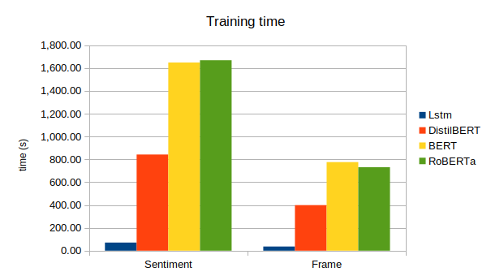

# tofu-sentiment-analysis

## What is the TOFU project?

The TOFU project aims to better understand and democratize the mechanisms underlying so termed
TOFUs (travelling of framed facts and uncertainties). In order to improve responsible research and
innovation, they are developing two digital tools to study, reflect on, and experiment with TOFUs, and
their governance. They are co-creating these reflective tools with stakeholders of possibly controversial technological innovations in the transition to sustainable energy and to sustainable food. The tools are: <br />
(1) The ‘TOFU-crawler’ to map networks of TOFUs, and to analyze how they travel, which become
dominant, and what governance strategies of national, international and transnational actors are to cope with these TOFUs. <br />
(2) The digital ‘dashboard of imagination’ that is a reflective instrument to help industry, govern-
mental actors, activists and NGO’s, but also scholars in responsible research and innovation to improve their interactions by addressing the TOFUs more explicitly and reflectively to enhance democratic technological innovations.

### What is this repository adding to the TOFU project?

Currently the TOFU tools work together as follows: <br />
(1) The ’TOFU-crawler’ scrapes websites of relevant actors to find articles concerning a domain a
researcher is interested in, for example: wind energy. The scraper finds all relevant pages/articles based on keywords provided by the researchers and passes the images and text of the page to the ’dashboard of imagination’. <br />
(2) The ’dashboard of imagination’ displays all the images the crawler provided it with on a scale
of ’Dream’ to ’Nightmare’. ’Dream’ being that the author of the article thinks the technology or novel
food is a dream come while true, while ’Nightmare’ means that the author thinks the technology is the
worst thing that possibly could have happened. This is were this repository comes in, the ranking of images is done by analysing the textual context, the article, in which an image is displayed. The analysing is done via sentiment analysis, a binary text classification task. In addition to the ranking of the images, frames used in the articles will be analysed as well, the frames WUR are interested in right now are: economic, health, environmental. This will be a multi-label text classification task. So on the dashboard every image gets a sentiment score and a frame score.

## Installing

Download the repository

```
git clone https://github.com/roel-kuiper/tofu-sentiment-analysis.git
```

The models need to be downloaded, from [this](https://drive.google.com/open?id=17s48ApEm3b6-MvCgT_HDNANQASBH6o27) location, and placed in the predicting directory (!) in order for the tool to work.

### Requirements

General libraries:

* numpy
* pandas
* glob

LSTM exclusive:

* gensim
* tensorflow
* keras

(Distil)BERT exclusive:

* [ktrain](https://github.com/amaiya/ktrain)

RoBERTa exclusive:

* [simpletransformers](https://github.com/ThilinaRajapakse/simpletransformers)

Data augmentation and labeling functions exclusive:

* textblob
* nltk
* snorkel
* re

## Running the tool

For all trained models a simple demo can be found under [predicting](https://github.com/roel-kuiper/tofu-sentiment-analysis/predicting). 
The best performing model is RoBerta, running this [demo](https://github.com/roel-kuiper/tofu-sentiment-analysis/blob/master/predicting/RoBERTa%20predicting.ipynb) will output the following results:

```
- - - - - - - - - - - - - - - -
articles/dummy article 1

Sentiment: 62.1%

- - - - - - - - - - - - - - - -

Economic frame: 82.8%
Health frame: 0.0%
Environment frame: 17.2%

- - - - - - - - - - - - - - - -

- - - - - - - - - - - - - - - -
articles/dummy article 2

Sentiment: 0.0%

- - - - - - - - - - - - - - - -

Economic frame: 25.0%
Health frame: 75.0%
Environment frame: 0.0%

- - - - - - - - - - - - - - - -
```

### Performance evaluation

The accuracy of the models was tested by predicting on labeled data provided by the WUR researchers at the TOFU project ([demonstration](evaluation/predictwur.ipynb)). Unfortunately, my laptop does not have a GPU, therefore the training time and speed of inference of all transformer based models will be slower than normal. So if we keep that in mind we can still see that, as expected, more extensively pretrained models take longer to train additional data on, but at the same time also perform better. For the TOFU project however speed of inference is not as important, since the inferencing can de done during the scraping pause. 





#### Failed additions


## Author

* [Roel Kuiper](https://github.com/roel-kuiper)


## Special thanks to:

* [Prof. Paul Groth](https://github.com/pgroth)
* [Dr. Tamara Metze-Burghouts](https://www.linkedin.com/in/tamara-metze-0a9b354/)
* [Dr. Elaine Texeira Rabello](https://www.linkedin.com/in/erabello/)
* [Efrat Gommeh](https://www.linkedin.com/in/efrat-gommeh-86267313/)
* Eduardo Rojas Padilla

